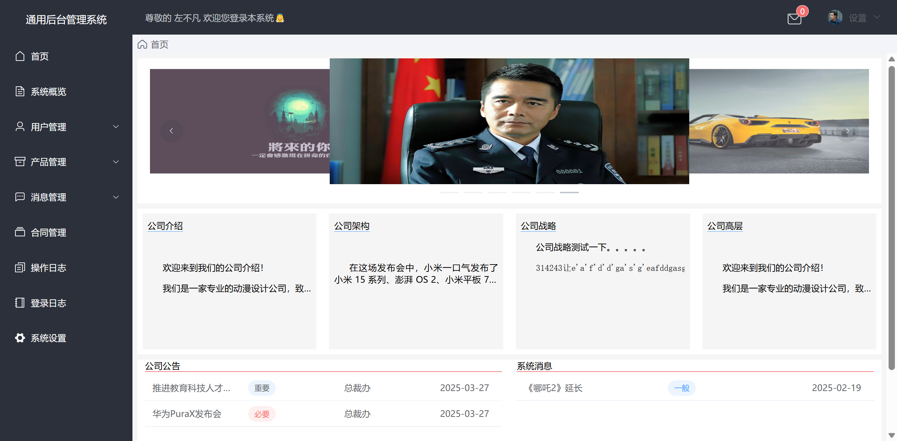
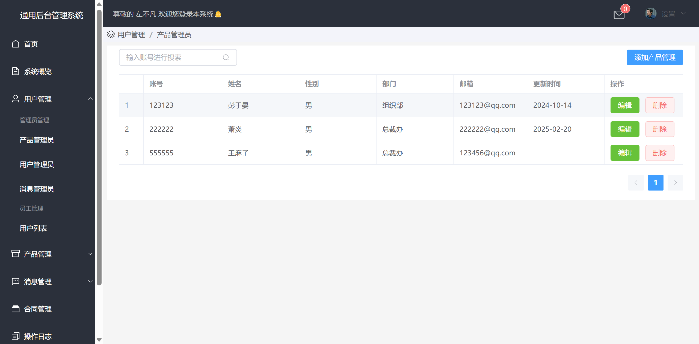
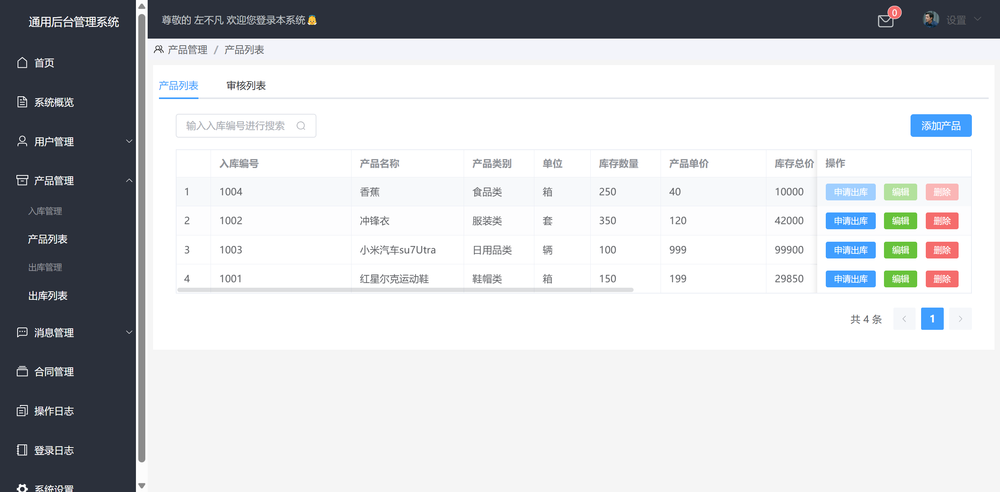
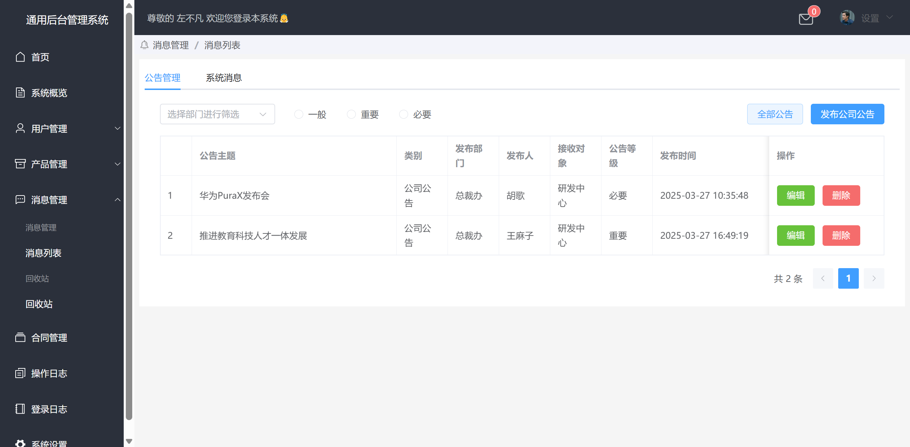
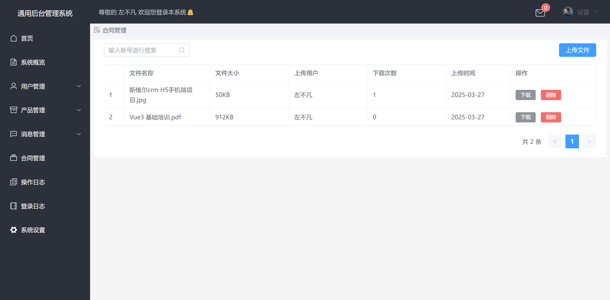
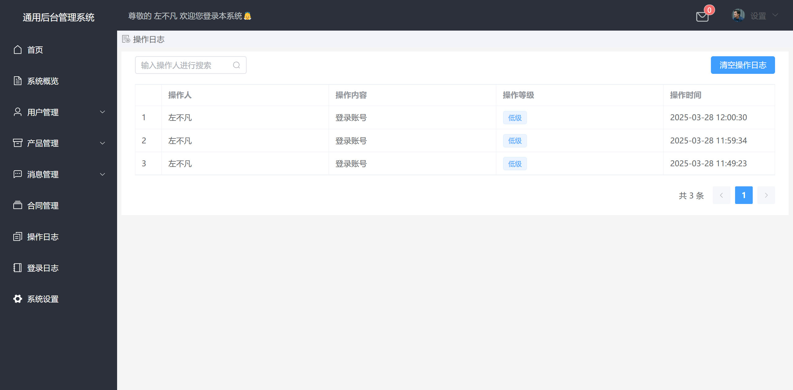
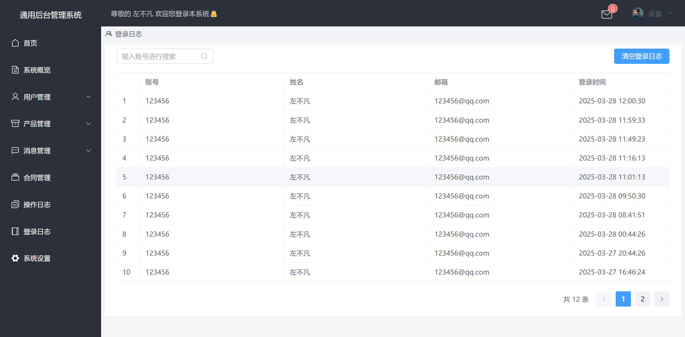
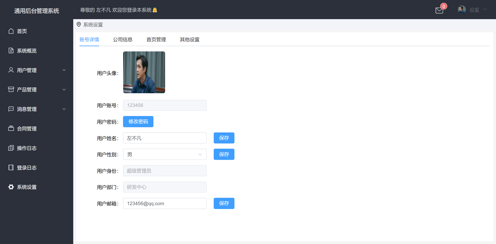

# front-end-admin

#### 介绍
vue+vite 项目前端管理系统 后台是nodejs

|  影视资源防丢失和谐.最新地址发布页                              | https://docs.qq.com/sheet/DSndLS0xUaG9WS1Fm?tab=BB08J2 |
| 初音未来，超解压工具，玩一整天停不下来，可以随意点击屏幕让miku唱出不一样的歌曲，非常洗脑 | https://mikutap.bqrdh.com/                             |
| 语录集，包含各种语录，不限于情话、心灵鸡汤、彩虹屁，道歉、互联网黑话等            | https://yl.bqrdh.com/catalogue                         |
| 出海指南                                           | https://chuhaizhinan.com/                    

#### 项目效果图
 **登录页面** 

 **首页**

 **用户管理列表** 

 **产品管理**
 
 **消息管理**
 
 **合同管理**
 
 **操作日志**
 
 **登录日志**
 
 **系统设置**
 
#### 本地存储key有效期
```js
// 存储数据，并设置一周后过期
function setItemWithExpiry(key, value, ttl) {
    const now = new Date();
    // 设置时间戳，当前时间 + 一周（604800000 毫秒）
    const item = {
        value: value,
        expiry: now.getTime() + ttl,
    };
    localStorage.setItem(key, JSON.stringify(item));
}
 
// 获取数据，检查是否过期
function getItemWithExpiry(key) {
    const itemStr = localStorage.getItem(key);
    if (!itemStr) {
        return null;
    }
    const item = JSON.parse(itemStr);
    const now = new Date();
    if (now.getTime() > item.expiry) {
        localStorage.removeItem(key);
        return null;
    }
    return item.value;
}
 
// 使用方法
const key = 'myKey';
const value = 'myValue';
const ttl = 7 * 24 * 60 * 60 * 1000; // 一周的时间，毫秒为单位
 
setItemWithExpiry(key, value, ttl);
const retrievedValue = getItemWithExpiry(key);
```